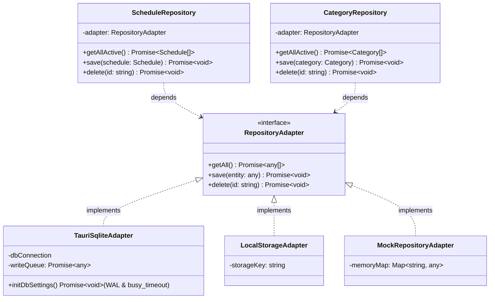
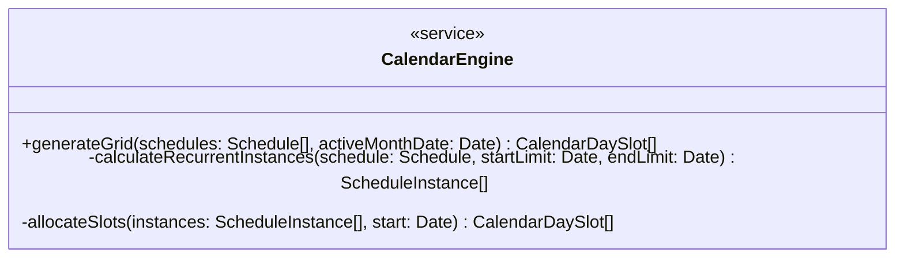
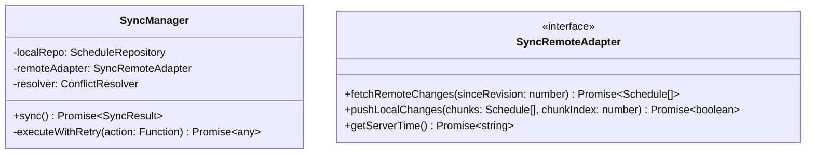

# Schedule 架构重构与模块深化设计规格书

本设计文档旨在解决 Schedule 桌面端项目当前的架构摩擦，将原有的浅模块（Shallow Modules）提炼为高内聚的深模块（Deep Modules），定义清晰的隔离接缝（Seam）与环境适配器（Adapter），以实现非 Tauri 环境运行与前端业务逻辑的秒级自动化测试。

## 1. 领域模型与核心术语定义

根据项目的本地域要求，以下定义共享词汇表：
- **数据仓储层 (Repository Module)**：用于完全隐藏 SQL 语句及底层数据引擎，提供纯 TypeScript 对象的自治深层接口。
- **仓储接缝 (Repository Seam)**：隔离业务 Store 与环境数据接口的逻辑切分层。
- **环境适配器 (Platform/Storage Adapter)**：具体平台环境的数据引擎实现。
- **日历引擎 (Calendar Engine)**：作为无状态的领域服务 (Domain Service)，提取排布和插槽冲突避让算法的深模块。
- **同步管理器 (Sync Manager)**：对网络与时钟误差补偿、重试重连流程统一管理的深模块。

---

## 2. 详细重构方案与模块深化

### 方案 1：建立深层仓储层 (Repository Module)，解耦 SQLite

#### 摩擦点分析
Pinia 的 `scheduleStore.ts` 强耦合底层 SQLite 驱动，充斥着大量的 SQL 拼接字符串（`SELECT`, `INSERT`, `UPDATE`）。非 Tauri 环境（如标准浏览器或纯前端测试）因为 `@tauri-apps/plugin-sql` 缺失导致抛错，极大影响了测试效率与多端适配性。

#### 设计详述
我们将持久化抽象为 `ScheduleRepository` 和 `CategoryRepository` 的深层模块。
引入统一的对象仓储接缝（Seam），即 `ScheduleRepository` 和 `CategoryRepository` 本身。它们对外提供纯 TypeScript 对象交互接口（`getAll()`, `save()`, `delete()`），屏蔽 SQL 与特定存储引擎细节。

仓储下属的**环境适配器**包含：
1. **`TauriSqliteAdapter`**：负责 Tauri 平台中的真实 SQLite 查询。为了防止并发写入导致的 `SQLITE_BUSY` 锁定，该适配器内部必须承接原有的 **Promise 串行写入队列 (`writeQueue`)** 以及 **WAL 模式**与 **`busy_timeout = 5000`** 的初始化配置。
2. **`LocalStorageAdapter`**：负责标准 Web 平台持久化。它直接基于原生的 `localStorage` / `IndexedDB` 读写 JSON 对象数据，**绝不在内部实现 SQL 解析器**，从而保持 Web 适配器的极简与稳定性。
3. **`MockRepositoryAdapter`**：负责单元测试中的临时高吞吐内存 Map 仿真。

#### 测试改进
单元测试仅需为仓储层挂载 `MockRepositoryAdapter`，即可在微秒级时间内校验 Store 中对分类和日程的数据操作逻辑，不用在测试机上预装或准备 SQLite 实例。

---

### 方案 2：封装日历网格计算为自治的日历引擎 (Calendar Engine)

#### 摩擦点分析
`calendarScheduler.ts` 是一个平铺的浅函数模块，仅提供 `generateCalendarGrid` 接口，却迫使外部操心复杂的 slot 覆盖、排序和时间段冲突计算。这些核心逻辑常外溢到 Vue 页面甚至导致多处重复。

#### 设计详述
设计纯净且无状态的领域服务 `CalendarEngine` 静态类或实例。为了避免与 Pinia 的持久化状态发生同步冲突，`CalendarEngine` 不主动持有 schedules 及日期数据作为实例属性，而是通过纯函数的形式接收参数：
- 对外接口提供：`generateGrid(schedules: Schedule[], activeMonthDate: Date): CalendarDaySlot[]`。
- 内部自治逻辑：过滤出活动视窗内的有效日程实例（解析 `daily` 等重复日程）、依据日程起始与时长进行槽位（Slot Index 0, 1, 2）的非冲突排序。

#### 测试改进
可直接在纯 JS/TS 测试环境下，向 `CalendarEngine.generateGrid` 传入包含多条时间冲突或每日重复属性的日程数据，断言网格数据中冲突槽位分配的正确度。无需挂载 Vue 视图。

---

### 方案 3：提炼同步服务的适配器层 (Sync Adapter)，定义显式的同步 Seam

#### 摩擦点分析
`SyncService` 中包含了对本地数据、远程数据的冲突解决合并逻辑。但目前它强制访问未受类型约束的 `(loc as any).revision`，这容易导致静态类型错误；同时其分片收发直接暴露为网络回调函数，逻辑非常零碎。

#### 设计详述
1. 在 `types/index.ts` 声明可选的 `revision?: number` 和 `isDeleted?: number` 属性到 `Schedule` / `Category` 接口。
2. 规范定义同步接缝 `SyncRemoteAdapter`。该接口规定了远程数据拉取、推送及服务器时间获取的接口标准。
3. 由 `SyncManager` 负责整合 `SyncRemoteAdapter` 与调解器 `ConflictResolver`。
4. **容错与重试机制**：`SyncManager` 内部包含重试调度器。当 `pushLocalChanges` 或拉取操作因网络故障失败时，使用**指数退避策略（即 1s, 2s, 4s 间隔重试，最多 3 次）**进行容错恢复。若最终重试均告失败，则抛出显式的 `SyncFailedException`，并触发注册的错误回调通知上层 Store 渲染相应的断网提示。

#### 测试改进
单元测试可以通过多态注入 `MockSyncRemoteAdapter` 来极其容易地伪造网络超时、分包 ACK 部分断链、以及服务端返回时钟偏差，用来专门对冲突调解逻辑（合并算法、LWW 裁决等）和指数退避重试进行各种异常分支测试。

---

## 3. 重构演进顺序安排

根据架构价值与痛点阻塞度，推荐按以下步骤实施：
1. **阶段 1 (仓储层)**：改造 `types/index.ts` 并搭建 Repository 和 Storage Adapter 多态逻辑。彻底移除 Store 里的 SQL 拼接，解耦 SQLite。
2. **阶段 2 (日历引擎)**：提炼 `CalendarEngine` 模块并移入核心算法，替换原 `calendarScheduler.ts`，简化 `SchedulesView.vue` 中的逻辑。
3. **阶段 3 (同步机制)**：完善 `SyncManager` 与 `SyncRemoteAdapter` 接口，修复无类型强转 `revision` 问题，提供网络隔离屏障并实现退避重试状态机。
